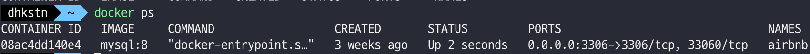

# 1장 도커란 무엇인가?
도커는 '데이터 또는 프로그램을 격리' 시키는 기능을 제공한다.

### 컨테이너와 도커 엔진
개인용 컴퓨터 또는 서버 상의 환경을 조립형 창고라고 생각해보면 작게 쪼개진 창고를 데이터나 프로그램을
두는 것이다. 도커 사용을 위해선 도커 엔진을 설치해야 한다.

### 컨테이너를 만드려면 이미지가 필요하다
컨테이너를 만들기 위해선 빵틀 역할을 위한 이미지가 필요하다.

### 도커는 리눅스 컴퓨터에서 사용한다.
윈도우나 맥에서도 도커를 사용할 수 있으나 내부적으로는 리눅스용 프로그램이다.

### 데이터나 프로그램을 독립된 환경에 격리해야 하는 이유
도커는 주로 서버 환경을 격리하기 위해 사용된다.
프로그램을 격리해야 하는 이유는 다음과 같다.  
프로그램은 주로 단독 실행이 아니라 어떤 실행 환경이나 라이브러리 등에 의해 동작한다.
소프트웨어 역시 단일이 아니라 여러 개의 프로그램으로 구성된 경우가 많다.
공유하는 대상을 한 쪽만 수정하면 다른 한쪽에서 문제가 생길수 있다. 문제의 대부분의 원인은 프로그램 간 공유에 있다.

# 2장 서버와 도커
서버란 어떤 서비스를 제공하는 것을 가리킨다.  
#### 도커의 구조
운영체제 위에 도커 엔진이 동작하고 그 위에서 컨테이너가 동작한다.

## 도커 컨테이너의 생애주기와 데이터 저장
도커 컨테이너는 일회용품처럼 쉽게 만들 수 있다. 새로운 버전이 나오면 새 컨테이너로
갈아타는 것이다.  
컨테이너가 폐기되면 당연히 그 안의 데이터는 사라진다. 이런 일을 방지하기 위해 도커가
설치된 물리적 서버의 디스크를 마운트해서 디스크에 저장한다.  
마운트란 디스크를 연결해 데이터를 기록할 수 있도록 한 상태이다.

### 도커의 장점
1. 독립된 환경
2. 이미지를 만들 수 있고 도커 허브에 배포할 수 있다.
3. 커널을 포함시킬 필요가 없다.
4. 한 대의 물리 서버에 여러 대의 서버를 띄울 수 있다.
5. 서버 관리가 쉽다.

### 도커의 단점
1. 물리 서버 한 대에 여러 서버를 띄우기에 호스트 서버에 문제가 생기면 모든 컨테이너에 영향이 미친다.
2. 컨테이너 하나만 사용할때는 도커의 장점을 느끼기 어렵고 단순 오버헤드에 지나지 않는다.

### 도커의 용도
1. 동일한 개발환경 제공 가능
2. 새로운 버전의 테스트 -> 격리된 환경을 이용해 테스트를 할 수 있다.
3. 동일 서버가 여러 대 필요한 경우!

#### 컨테이너 조작 관련 커맨드(container)
```java
docker contatiner 하위_커맨드 옵션  
start / 컨테이너를 실행 / 생략 가능 / -i
stop / 컨테이너를 정지 / 생략 가능 / 사용 X
create / 이미지로 컨테이너를 생성 / 생략 가능 / --name -e -p -v
run / 도커 이미지를 내려받고 컨테이너를 생성해 실행한다. / 생략 가능 / --name -e -p -v -d -i -t
rm / 정지 상태의 컨테이너를 삭제 / 생략 가능 / -f -v
exec / 실행 중인 컨테이너 속에서 프로그램을 실행 / 생략 가능 / -i -t
ls / 컨테이너 목록 출력
cp / 도커 컨테이너와 도커 호스트 간에 파일을 복사
commit / 도커 컨테이너를 이미지로 변환
```

#### 이미지 조작 관련 커맨드(image)
```java
docker image 하위_커맨드 옵션
pull / 도커 허브 등의 레포지토리에서 이미지를 내려받음 / 생략 가능
rm / 도커 이미지를 삭제
ls / 내려 받은 이미지의 목록을 출력
build / 도커 이미지를 생성
```

#### 볼륨 조작 관련 커맨드(volume)
```java
docker volume 하위_커맨드 옵션
create / 볼륨 생성
inspect / 볼륨 상세 정보 출력
ls / 볼륨 목록 출력
prune / 현재 마운트되지 않은 볼륨을 출력
rm / 지정한 볼륨을 삭제
```

#### 네트워크 조작 관련 커맨드(network)
```java
docker network 하위_커맨드 옵션
connect / 도커 네트워크에 연결
disconnect / 네트워크 연결 해제
create / 네트워크 생성
inspect / 상세 정보 출력
ls / 도커 네트워크 목록을 출력
prune / 현재 컨테이너가 접속하지 않은 네트워크를 모두 삭제
rm / 지정 네트워크 삭제
```

#### 단독 커맨드
```java
login / 도커 레지스트리에 로그인
logout / 도커 레지스트리에 로그아웃
search / 도커 레지스트리를 검색
version / 도커 엔진 및 도구의 버전을 출력
```

## 컨테이너의 생성과 삭제, 실행, 정지

#### docker run 관련 커맨드 예시
```java
docker run (옵션) 이미지 (인자)
--name / 컨테이너 이름
-p 호스트_포트번호:컨테이너_포트번호 / 포트 번호 지정 / ex -p 8080:8080
-v 호스트_디스크:컨테이너_디렉터리 / 볼륨을 마운트함
--net=네트워크_이름 / 컨테이너를 네트워크에 연결함
-e 환경변수_이름=값 / 환경변수를 설정함
-d / 백그라운드로 실행함
-i / 컨테이너에 터미널을 연결함
-t / 특수 키 사용이 가능하게 함
-help / 안내 메시지 출력
    
정지 및 삭제 명령어    
docker stop 컨테이너_이름
docker rm 컨테이너_이름
```

#### docker ps 커맨드
실행 중인 컨테이너 목록을 출력한다.

컨테이너 목록의 주요 항목
```java
CONTAINER ID: 컨테이너 식별자로 무작위 문자열이 할당된다. 본래 64글자이지만 앞의 12글자만 출력한다.
IMAGE: 컨테이너를 만들때 이미지의 이름
COMMAND: 실행 시에 실행되도록 설정된 프로그램의 이름
CREATED: 컨테이너 생성 후 경과 시간
STATUS: 컨테이너의 현재 상태 / 실행 중이면 up, 아니면 exited
PORTS: 컨테이너에 할당된 포트 번호 '호스트포트번호->컨테이너포트번호' 형식으로 출력된다. 번호가 동일한 경우 뒷 부분은 출력 안된다.
NAMES: 컨테이너의 이름
```
