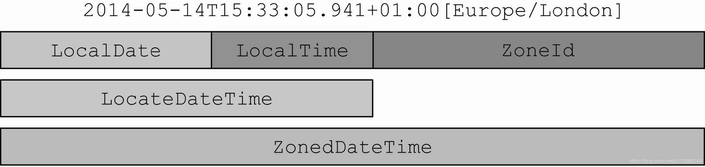

# 12장 새로운 날짜와 시간 API
### 자바 8 이전 API의 문제
* Date 클래스는 직관성, 유용성이 떨어지게 설계되었다.
* Date를 보완하기 위한 Calendar 또한 설계 문제로 에러를 일으킨다.
* DateFormat 또한 스레드에 안전하지 못했다.
* 가변 클래스였기에 유지보수가 아주 어려워졌다.

## 12.1 LocalDate, LocalTime, Instant, Duration, Period 클래스
### 12.1.1 LocalDate와 LocalTime 사용
LocalDate는 시간을 제외한 날짜를 표현하는 불변 객체이다. 어떤 시간대 정보도 포함하지 않는다.  
정적 팩토리 메서드 of로 객체를 만들 수 있다.

팩토리 메서드 now를 통해 현재 날짜 정보를 얻을 수도 있다.
```java
LocalDate date = LocalDate.of(2014, 3, 10);
int year = date.getYear(); // 2014
Month month = date.getMonth(); // MARCH
int day = date.getDayOfMonth(); // 18
DayOfWeek dow = date.getDayOfWeek(); // TUESDAY
int len = date.lengthOfMonth(); // 31 (3월의 길이)
boolean leap = date.isLeapYear(); // false (윤년이 아님)
System.out.println(date);

LocalDate now = LocalDate.now(); // 현재 날짜 정
```

시간에 대한 정보는 LocalTime 클래스로 표현할 수 있다. LocalTime도 정적 메서드 of로 인스턴스를 만들 수 있다.  
```java
LocalTime time = LocalTime.of(13, 45, 20); // 13:45:20
int hour = time.getHour(); // 13
int minute = time.getMinute(); // 45
int second = time.getSecond(); // 20
System.out.println(time);
```

parse 라는 정적 메서드를 활용해 문자열을 통해 객체를 만들수도 있다.
```java
LocalDate date = LocalDate.parse("2022-06-08");
LocalTime time = LocalTime.parse("17:55:55");
```

### 12.1.2 날짜와 시간 조합
LocalDateTime은 LocalDate와 LocalTime을 쌍으로 갖는 복합 클래스다. 날짜와 시간을 모두 표현하고, of를 통해 만들 수 있다. 
atDate, atTime을 통해서도 만들 수 있다.
```java
LocalDateTime dt1 = LocalDateTime.of(2014, Month.MARCH, 18, 13, 45, 20); // 2014-03-18T13:45
LocalDateTime dt2 = LocalDateTime.of(date, time);
LocalDateTime dt3 = date.atTime(13, 45, 20);
LocalDateTime dt4 = date.atTime(time);
LocalDateTime dt5 = time.atDate(date);
```

toLocalDate 또는 toLocalTime 메서드로 LocalDate, LocalTime 인스턴스를 추출할 수 있다.
```java
LocalDate date1 = dt1.toLocalDate();
LocalTime time1 = dt1.toLocalTime();
```

### 12.1.3 Instant 클래스 : 기계의 날짜와 시간
사람은 보통 주,날짜,시간,분으로 날짜와 시간을 얘기한다. java.time.Instant는 UTC 시간(1970년 1월 1일 0시 0분 0초)을 기준으로
특정 지점까지의 시간을 초로 표현한다. 팩토리 메서드 ofEpochSecond에 초를 넘겨 인스턴스를 생성할 수 있다.  
나노초를 제공해 두번째 인수를 사용해 나노초 시간을 정의할 수 있다.(0~999,999,999 사이의 값)
```java
Instant instant = Instant.ofEpochSecond(44 * 365 * 86400);
Instant now = Instant.now();
```

### 12.1.4 Duration과 Period 정의
지금까지 살펴본 모든 클래스는 Temporal 인터페이스를 구현하는데, 
Temporal 인터페이스는 특정 시간을 모델링하는 객체의 값을 어떻게 읽고 조작할지 정의한다.  
두 객체 사이의 지속시간을 활용할 수 있는 Duration 클래스가 있다.
Duration은 초와 나노초로 시간을 표현하기에 LocalDate를 전달할 수 없다.  
년,월,일 시간을 표현할땐 Perior 클래스의 between이라는 팩토리 메서드를 활용하면 차이를 알 수 있다.
지금까지의 모든 클래스는 불변이다. 함수형 프로그래밍, 스레드 안정성과 도메인 모델의 일관성을 유지하는데 좋다.  
```java
Duration d1 = Duration.between(LocalTime.of(13, 45, 10), time);
Duration d2 = Duration.between(instant, now);
Period between = Period.between(date, LocalDate.of(2015,3,18));
```

## 12.2 날짜 조정, 파싱, 포매팅
withAttribute 메서드를 사용하면 일부 속성이 수정된 상태의 새로운 객체를 반환받을 수 있다. 
get과 with 메서드로 Temporal 객체의 필드값을 읽거나 고칠 수 있으며 Temporal 객체가 지정된 필드를 지원하지 않으면
UnsupportedTemporalTypeException이 발생한다.


### 12.2.1 TemporalAdjusters 사용하기
간단한 날짜 기능이 아닌 더 복잡한 날짜 조정기능이 필요할 때 with 메서드에 TemporalAdjuster를 전달하는 방법으로 문제를 해결할 수 있다. 
날짜와 시간 API는 다양한 상황에서 사용할 수 있도록 다양한 TemporalAdjuster를 제공한다  
```java
LocalDate date1 = LocalDate.of(2014, 3, 18); // 2014-03-18 (화)
LocalDate date2 = date1.with(nextOrSame(DayOfWeek.SUNDAY)); // 2014-03-23
LocalDate date3 = date2.with(lastDayOfMonth()); // 2014-03-31

LocalDateTime time = currentDateTime
        .with(TemporalAdjusters.firstDayOfYear())       // 이번 년도의 첫 번째 일(1월 1일)
        .with(TemporalAdjusters.lastDayOfYear())        // 이번 년도의 마지막 일(12월 31일)
        .with(TemporalAdjusters.firstDayOfNextYear())   // 다음 년도의 첫 번째 일(1월 1일)
        .with(TemporalAdjusters.firstDayOfMonth())      // 이번 달의 첫 번째 일(1일)
        .with(TemporalAdjusters.lastDayOfMonth())       // 이번 달의 마지막 일
        .with(TemporalAdjusters.firstDayOfNextMonth())  // 다음 달의 첫 번째 일(1일)
        .with(TemporalAdjusters.firstInMonth(DayOfWeek.MONDAY)) // 이번 달의 첫 번째 요일(여기서는 월요일)
        .with(TemporalAdjusters.lastInMonth(DayOfWeek.FRIDAY))  // 이번 달의 마지막 요일(여기서는 마지막 금요일)
        .with(TemporalAdjusters.next(DayOfWeek.FRIDAY))       // 다음주 금요일
        .with(TemporalAdjusters.nextOrSame(DayOfWeek.FRIDAY)) // 다음주 금요일(오늘 포함. 오늘이 금요일이라면 오늘 날짜가 표시 된다.)
        .with(TemporalAdjusters.previous(DayOfWeek.FRIDAY))     // 지난주 금요일
        .with(TemporalAdjusters.previousOrSame(DayOfWeek.FRIDAY));// 지난주 금요일(오늘 포함)
```

### 12.2.2 날짜와 시간 객체 출력과 파싱
날짜와 시간 관련 작업에서 포매팅과 파싱은 필수적이다. java.time.format 패키지가 이를 지원한다. 가장 중요하게 알아야 할 클래스는 DateTimeFormatter이다. 
정적 팩토리 메서드와 상수를 이용해서 손쉽게 포매터를 만들 수 있다.(java.time.format) 여기서 가장 중요한 클래스는 DataTimeFormatter이다.  
LocalDate의 format 메서드는 요청 방식에 해당하는 문자열을 생성한다.
```java
LocalDate date = LocalDate.of(2014, 3, 18);
String s1 = date.format(DateTimeFormatter.BASIC_ISO_DATE); // 20140318
String s2 = date.format(DateTimeFormatter.ISO_LOCAL_DATE); // 2014-03-18
  
//반대로 날짜 객체로도 만들 수 있다.       
LocalDate date1 = LocalDate.parse("20140318", DateTimeFormatter.BASIC_ISO_DATE);
LocalDate date2 = LocalDate.parse("2014-03-18", DateTimeFormatter.ISO_LOCAL_DATE);

LocalDate date = LocalDate.of(2014, 3, 18);
DateTimeFormatter formatter = DateTimeFormatter.ofPattern("dd/MM/yyyy");
date.format(formatter)
```

## 다양한 시간대와 캘린더 활용 방법
기존의 java.util.TimeZone을 대체할 수 있는 java.time.ZoneId 클래스가 새롭게 등장했다. 
ZoneId를 이용하면 서머타임 같은 복잡한 사항이 자동으로 처리된다.

### 12.3.1 시간대 사용하기
표준이 같은 지역을 묶어서 시간대(time zone) 규칙 집합을 정의한다. ZoneRules 클래스에는 약 40개 정도의 시간대가 있다. 
ZoneId의 getRules()를 이용해서 해당 시간대의 규정을 획득할 수 있다.
```java
ZoneId romeZone = ZoneId.of("Europe/Rome");
LocalDate date = LocalDate.of(2014, 13, 18);
ZonedDateTime zdt = date.atStartOfDay(romeZone);

ZoneId zoneId = TimeZone.getDefault().toZoneId();
```
지역 ID는 '{지역}/{도시}' 형식으로 이루어 진다. 지역집합 정보는 IANA Time Zone Database에서 제공하는 정보를 사용한다. 
getDefault() 메서드를 이용하면 기존의 TimeZone 객체를 ZoneId 객체로 변환할 수 있다.



## 마치며
* 자바 8 이전 버전에서 제공하던 클래스들의 불일치성과 가변성 등 설계 결함이 존재했다.
* 새로 생긴 클래스들은 모두 불변이다.
* 새 aPI는 두 가지 표현 방식을 제공한다.
* 절대적, 상대적인 방법 두 가지로 처리할 수있으며 기존 인스턴스를 변환하지 않도록 새 인스턴스가 반환된다.
* 특정 포맷으로 출력하는 포매터를 정의할 수 있다. 포매터 또한 스레드 안정성을 보장한다.
