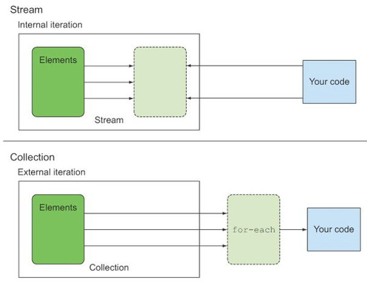

# 4장 스트림 소개

##### 컬렉션이 없다면?

컬렉션은 데이터를 그룹화하고 처리할 수 있다. 없다면 하나하나 해줘야 하기에 코드도 늘어나고  
보기 좋지 않을 것이다.

### 스트림이란 무엇인가?

스트림은 자바8 API에 추가된 기능이다. 스트림으로 데이터 컬렉션 반복을 처리할 수 있고, 멀티스레드 코드를 이용하지 않아도 된다.

다음은 자바7과 자바8 코드의 비교이다. 확연히 코드의 길이가 다른 점을 알 수 있다.

```java
//자바 7버전
List<Dish> lowCaloricDished=new ArrayList<>();
        List<Dish> menu=List.of(
        new Dish(150,"fish"),
        new Dish(200,"meat"),
        new Dish(100,"rice"),
        new Dish(400,"seaweed")
        );
        for(Dish dish:menu){
        if(dish.getCalorie()<=150){
        lowCaloricDished.add(dish);
        }
        }

        Collections.sort(lowCaloricDished,new Comparator<Dish>(){
@Override
public int compare(Dish o1,Dish o2){
        return o1.getCalorie()-o2.getCalorie();
        }
        });

        List<String> dishName=new ArrayList<>();
        for(Dish dish:lowCaloricDished){
        dishName.add(dish.getName());
        }

//자바 8버전
        List<String> collects=menu.stream()
        .filter(e->e.getCalorie()<=150)
        .sorted(comparing(Dish::getCalorie))
        .map(Dish::getName)
        .collect(Collectors.toList());
```

filter는 고수준 빌딩 블록으로 이뤄져 있어서 특정 스레딩 모델에 국한되지 않고 자유롭게 사용할 수 있다.

#### 스트림의 특징 3가지

* 선언형: 간결하고 가독성이 좋아진다.
* 조립할 수 있다: 유연성이 좋아진다.
* 병렬화: 성능 개선

### 스트림 시작하기

> 스트림이란? 데이터 처리 연산을 지원하도록 소스에서 추출된 연속된 요소로 정의할 수 있다.

* 연속된 요소
    * 특정 요소 형식으로 이뤄진 연속된 값 집합의 인터페이스를 제공한다.
    * 컬렉션은 자료구조이기에 시간,공간 복잡성과 관련 요소 저장 및 접근 연산이 주를 이룬다.
    * 그러나 **스트림**은 filter, sorted, map 등 표현 계산식이 주를 이룬다.
    * 컬렉션은 데이터가 주이고, 스트림은 계산이 주인 것이다.
* 소스
    * 스트림은 다양한 데이터로부터 데이터를 소비한다.
    * 정렬된 컬렉션으로 생성하면 정렬이 유지된다.
* 데이터 처리 연산
    * 스트림은 함수형 언어 제공 연산과 비슷한 연산을 지원한다.
    * 순차적 또는 병렬로도 연산을 수행할 수 있다.

#### 스트림의 주요 특징

* 파이프라이닝
    * 스트림 연산끼리 연결해 파이프라이닝을 구성할 수 있다.
* 내부 반복
    * 컬렉션은 명시적으로 외부 반복을 하나 스트림은 내부 반복을 지원한다.

### 스트림과 컬렉션

컬렉션과 스트림 모두 **연속된** 요소 형식 값을 저장하는 인터페이스를 제공한다.  
연속된이란 표현은 순차적으로 접근한다는 것을 의미한다. 여기서 스트림과 컬렉션의 차이가 발생한다.  
데이터를 언제 계산하느냐가 컬렉션과 스트림의 차이이다.  
컬렉션은 모든 값을 메모리에 저장하는 자료구조이다. 모든 요소는 컬렉션에 추가하기 전에 계산 되어야 한다.  
스트림은 이론적으로 요청할 때만 요소를 계산하는 고정 자료구조이다. 또한 스트림은 한 번만 탐색될 수 있다.

#### 외부 반복과 내부 반복

  

컬렉션은 사용자가 직접 요소를 반복해야 하는 외부 반복이다.

```java
List<String> names=new ArrayList<>();
        for(Dish dish:menu){
        names.add(dish.getName());
        }
```

반면 스트림은 내부반복으로 어떤 이점이 있는지 알아보자

```java
List<String> collects=menu.stream()
        .filter(e->e.getCalorie()<=150)
        .sorted(comparing(Dish::getCalorie))
        .map(Dish::getName)
        .collect(Collectors.toList());
```

#### 내부 반복 장점

> 작업을 투명하게 병렬로 처리할 수 있다.  
> 더 최적화된 순서로 처리할 수 있다.

### 스트림 연산

스트림에서 연산은 크게 두 가지로 분류할 수 있다.

1. 중간 연산
    * 중간 연산은 다른 스트림을 반환한다.
    * 여러 연산을 합칠 수 있다.
    * 300칼로리가 넘는 요리는 여러 개지만 처음 3개만 선택됐다.(쇼트서킷 기법)
    * filter, map은 다른 연산이지만 병합되었다.(루프 퓨전이라고 한다)

```java
List<String> names=menu.stream()
        .filter(dish->{
        System.out.println("filtering "+dish.getName());
        return dish.getCalories()>300;
        })
        .map(dish->{
        System.out.println("mapping "+dish.getName());
        return dish.getName();
        })
        .limit(3)
        .collect(toList());
        System.out.println(names);
```

2. 최종 연산
    * 최종 결과를 도출한다.
    * 스트림 이외의 컬렉션, 배열, void 등을 반환한다.

### 스트림 이용하기

#### 중간연산

|    연산    |형식|   반환 형식   |    연산의 인수     |   함수 디스크럽터    |
|:--------:|:---:|:---------:|:-------------:|:-------------:|
|  filter  | 중간 연산 | Stream<T> | Predicate<T>  | T -> boolean  |
|   map    | 중간 연산 | Stream<R> | Fuction<T,R>  |    T -> R     |
|  limit   | 중간 연산 | Stream<T> |               |               |
|  sorted  | 중간 연산 | Stream<T> | Comparator<T> | (T, T) -> int |
| distinct | 중간 연산 | Stream<T> |               |               |

#### 최종연산

|   연산    |  형식   |     반환 형식     |            목적            |
|:-------:|:-----:|:-------------:|:------------------------:|
| forEach | 최종 연산 |     void      | 스트림의 각 요소를 소비해 람다를 적용한다. | 
|  count  | 최종 연산 | long(generic) |    스트림의 요소 개수를 반환한다.     |  
| collect | 최종 연산 |  Collections  | 스트림을 리듀스해서 여러 컬렉션을 만든다.  | 

### 마치며
* 스트림은 소스에서 추출된 연속 요소로, 데이터 처리 연산을 지원한다.
* 내부반복을 지원해 반복을 추상화한다.
* 스트림은 중간연산과 최종연산이 있다.
* 스트림의 요소는 게으르게 계산된다.