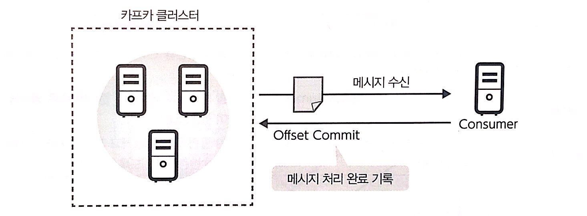

# 11장 카프카 능숙하게 사용하기

## 컨슈머 그룹
**컨슈머 그룹이란 ?**
카프카에서는 컨슈머가 카프카 클러스테에서 메시지를 얻어 처리한다. 이때 컨슈머는 컨슈머 그룹이라
불리는 하나 이상의 컨슈머들로 이루어진 그룹으을 형성하여 메시지를 얻는다. 컨슈머 그룹은 Group ID라는 ID로 구분된다.

컨슈머 그룹은 Group ID가 동일한 컨슈머끼리 형성된다. 
참고로 특정 컨슈머는 여러 컨슈머 그룹에 속하지 않고 항상 하나의 컨슈머 그룹에 속한다.

카프카 클러스터에서 수신할 메시지는 컨슈머 그룹 안에서 어느 하나의 컨슈머가 수신한다. 
카프카 클러스터에서 수신할 메시지를 동일한 컨슈머 그룹에 속하는 **컨슈머 사이에서 분산하여 수신**한다.

### 컨슈머에서 파티션 할당
어떤 메시지를 컨슈머 그룹의 어느 컨슈머가 수신하는가에 대한 할당은 수신할 토픽에 존재하는 파티션과 그룹 내 컨슈머를 매핑함으로써 가능하다.
카프카 클러스터에서 다루는 메시지는 특정 토픽 중 특정 파티션에 반드시 포함된다. 메시지는 컨슈머 그룹에서 각 파티션에 매핑되는 컨슈머가 수신하게 된다.

컨슈머와 파티션의 매핑은 각 파티션에 반드시 하나 이상의 컨슈머가 매핑된다. 반대로 파티션 수에 따라 하나의 컨슈머에 여러 파티션이 할당되는 경우가 있다. 
특정 파티션에 기록되는 메시지는 매핑된 컨슈머가 처리하는 것으로 되어 있기 때문에 컨슈머 그룹 내의 특정 컨슈머가 반드시 처리하게 된다. 
따라서 메시지를 수신하는 토픽의 파티션보다 컨슈머 쪽이 많은 경우 타티션이 할당되지 않은 컨슈머가 발생할 수 있다.

컨슈머 그룹에 새로운 컨슈머가 가입한 경우 필요에 따라 그때그때 결정된다. 이 결정은 컨슈머가 설정되어 있는 어사이너로직에 따라 실시된다.

| 어사이너           | 클래스| 할당방법|
|----------------|---|---|
| Round Robin    | RoundRobinAssignor  | 매핑할 파티션을 컨슈머에 하나씩 차례로 매핑 한다.|
| Range(Default) | RangeAssignor  | 매핑할 파티션을 나열하고 컨슈머 수로 영역을 분할하여 할당한다.|
| Sticky         | StickyAssignor  | 최대한 균형있게 할당하고 재할당 시에는 원래의 매핑에서 변경되지 않도록 할당한다.|

### 오프셋 커밋
카프카를 사용하는 시스템에서는 컨슈머가 카프카 클러스터에서 메시지를 얻어 처리한다. 
이 때 컨슈머는 어느 메시지까지 처리를 완료했는지 카프카 클러스터에 기록을 남길수 있다.(정확하게는 다음 수신 및 처리해야할 메시지의 오프셋틀 기록한다.) 이 기록을 남기는 처리를 오프셋 커밀이라고 한다. 
이 오프셋 커밋은 각 컨슈머가 카프카 클러스터에 기록을 요청함으로써 실행한다.

오프셋 커밋의 기록은 컨슈머 그룹 단위로 이루어진다. 컨슈머 그룹 마다 각 토픽의 파티션에서 어느 오프셋까지 처리 완료 했는지 정보를 기록한다. 
오프셋 커밋은 처리 완료 여부를 메시지마다 기록하는 것이 아니라 처리를 완료한 메시지 중에 최대의 오프셋을 기록하는 형태로 이루어진다.

오프셋 커밋 정보에 의해 컨슈머는 카프카에서 메시지를 처리를 개재할 때 어떤 메시지부터 재개해야 하는지 알 수 있다.  
여기서는 유지보수 등 계획된 정지에서 재개하는 것 외에도 장애에 의한 비정상적인 정지에서의 재개도 포함된다.  
재개 후에 새로운 메시지만이 처리되므로써 처리되지 않은 메시지와 동일 메시지 재처리를 방지하거나 그 영향을 줄일 수 있다.  

커밋된 오프셋 정보는 __consumer_offsets라는 전용 토픽에 기록한다. 
이 토픽은 일반 토픽 처럼 파티션과 복제본의 구조를 하고 있다. 이 메커니즘에 의해 카프카 클러스터는 오프셋 커밋 처리를 분산할 수 있이며, 
여러 대의 브로커가 정지해도 데이터 손실 없이 처리할 수 있다.  
(토픽의 기본 설정은 파티션 수 50, 레플리케이션은 3으로 설정)

### 자동 오프셋 커밋
자동 오프셋 커밋은 일정 간격마다 자동으로 오프셋 커밋을 하는 방식이다.
컨슈머의 옶션 enable.auto.commit을 true로 설정하여 사용할 수 있다.  
오프셋 커밋의 간격은 auto.commit.interval.ms로 지정 할 수 있이며, 기본 값은 5초이다.  

자동 오프펫 커밋의 장점은 컨슈머 애플리케이션에서 오프셋 커밋을 명시적으로 실시할 필요가 없다는 점이다. 
수동 오프셋에서는 항상 오프셋 커밋을 처리를 해야 하지만 이 방법에서는 그럴 필요가 없이 컨슈머 애플리케이션이 간결해진다. 
반면 컨슈머에 장애가 발생했을 때 메시지가 손실되거나, 여러 메시지의 재처리(메시지 중복)가 발생할 수 있다는 단점이 있다

오프셋 커밋이 일정한 간격으로 이뤄지기에 장애가 발생한 타이밍에 따라 오프셋 커밋된 메시지가 처리가 완료되지 않거나 
여러 메시지 처리가 완료됐지만 오프셋 커밋이 이루어지고 있지 않은 경우가 발생할 수 있다.

전자는 장애가 발생했을 때 처리 중이던 메시지까지 오프셋 커밋이 이루어지고 있기 때문에 처리를 복구시켰을 때 장애가 발생한 때의 메시지가 처리되지 않게 된다.  
후자는 장애가 발생 시 처리가 완료된 여러 메시지에 대해 오프셋 커밋이 이루어 지지 않았으므로 처리를 재개했을 때 동일 메시지를 여러 번 처리하게 된다.

### 수동 오프셋
메시지를 처리 완료할 때마다 오프셋 커밋을 실시 하는 기법이다.
수동 오프셋 커밋은 컨슈머 애플리케이션 안에서 Kafka Comsumer의 commitSync 또는 commitAsync라는 메서드를 이용하여 오프셋 커밋을 실행한다. 
스트림 처리 프레임워크 등을 이용하고 있는 경우 이 메서드들을 직접 사용하지 않을 수도 있다.

수동 오프셋 커밋의 장점은 구조를 이해하고 적절히 사용함으로써 메시지 손실을 발생하지 않도록 할 수 있다는 점이다. 카프카 클러스터에서 메시지 취득 후 메시지 처리가 완료한 시점에서 커밋을 할 수 있다. 
해당 메시지 처리는 완료되어 있기 때문에 메시지 손실이 발생하지 않는다.

수동 오프셋 커밋에서 컨슈머 장애가 발생 시 메시지 중복을 최소화 할 수 있다. 자동 오프셋 커밋에서 컨슈머 장애 발생 시에 여러 메시지가 커밋되지 않은 경우가 있으며 
그로 인하여 여러 메시지의 중복이 발생한다. 수동 오프셋 커밋에서는 장애가 발생 했을 때 처리 중에 메세지의 중복 가능성이 
남아 있지만, 이미 처리 완료된 메시지를 포함한 메시지 중복을 피할 수 있다.

단 메시지 양에 따라 다르지만 수동 오프셋 커밋이 자주 커밋 처리를 실시하므로 카프카 클러스터 부하가 높아진 다는 점에는 주의가 필요 하다.

카프카에서 송신된 모든 메시지는 반드시 1회 이상 컨슈머에서 수신되는 것을 보장한다는 뜻이다. (At Least Once)

### 자동 오프셋 리셋
오프셋 커밋 정보를 참조하여 메시지 처리를 시작할 오프셋을 결정한다. 그러나 시작할 때 오프셋 커밋 기록이 존재하지 않는 경우나 기록되어 있는 오프셋이 
유효하지 않은 경우는 지정된 정책에 따라 초기화를 실시하여 메시지 처리할 오프셋을 결정 한다. 
이 초기화 처리를 자동 오프셋 리셋 이라고 한다.

| 어사이너             | 클래스|
|------------------|---|
| latest(default)	 | 해당 파티션의 가장 새로운 오프셋으로 초기화된다. 따라서 카프카 클러스터에서 이미 존재하는 메시지는 처리되지 않는다.|
| earliest         | 해당 파티션에 존재하는 가장 오래된 오프셋으로 치기화된다. 카프카 클러스터에 이미 존재하는 메시지 모두에 대해 처리를 실시한다.|
| none             | 유효한 오프셋 커밋 정보가 없는 경우 예외가 발생한다.|

### 파티션 재배치
카프카에서의 파티션은 하나 이상의 복제본을 가지며, 카프카 클러스터 중 어느 하나의 브로커에 보관되어 있다. 
일반적으로 복제본은 작성된 때 배치된 브로커에서 계속 보관되지만 특정 이유로 배치를 변경하고 싶은 경우가 있다.

본제본의 배치를 변경하는 주된 이유는 카프카 클러스터의 브로커를 증감시키는 경우다. 카프카에서 계획적인 정지나 
장애로 인한 정지를 불문하고 브로커가 보유하고 있던 보제본이 다른 브로커로 자동으로 이동되지 않는다.

브로커를 추가하여 클러스터를 확장시킬 경우에도 새로 추가한 브로커에 복제본을 배치하여 메시지의 송수신 부하를 균등하게 배분해야 한다. 
이렇게 파티션 각 복제본을 임의의 브로커에 재배치하는 작업을 파티션 재배치라고 한다.

