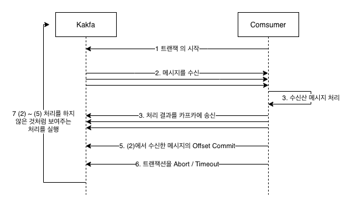
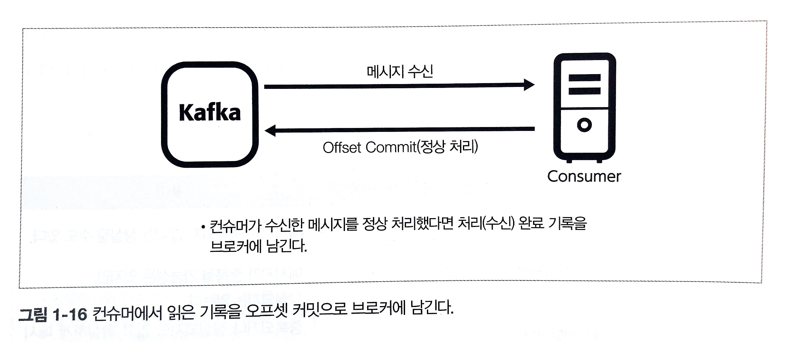

# 1장 아파치 카프카

아파치 카프카는 여러 대의 분산 서버에서 대량의 데이터를 처리하는 분산 메시징 시스템이다. 메시지를 받고, 다른 시스템이나 장치에 보내기 위해 사용된다.

카프카는 대량의 데이터를 높은 처리량과 실시간으로 처리하기 위한 제품으로 4가지를 실현할 수 있다.

* 확장성: 여러 서버로 확장 구성할 수 있다.
* 영송성: 수신한 데이터를 디스크에 유지할 수 있기에 언제라도 데이터를 읽을 수 있다.
* 유연성: 시스템을 연결하는 허브 역할을 한다.
* 신뢰성: 메시지 전달 보증을 하므로 데이터 분실을 걱정하지 않아도 된다.

### 카프카 이전 제품

크게 메시지 큐, 로그 수집 등이 있었다.  
메시지 큐에서 제공하는 것은 트랜잭션을 지원해 메시지가 정확히 한 번만 전달되는 것을 보증할 수 있었다. 그러나 링크드인에서는 높은 처리량의 실현이 우선이었다. 대량의 메시지
처리를 위해 여러 서버를 두어야 했는데 메시지 큐 제품은 스케일 아웃을 전제로 한 제품이 없었다.

### 메시징 모델과 스케일 아웃

카프카는 요구 사항을 만족시키기 위해 메시징 모델을 채용했다. 메시징 모델은 다음 세 가지 요소로 구성된다.

```java
Producer:메시지 생산자
Broker:메시지 수집 전달 역할
Consumer:메시지 소비자
```

카프카 메시징 모델을 설명하기 위해 기존 큐잉 모델과 pub/sub 메시징 모델을 살펴보자

#### 큐잉 모델

브로커 안에 큐를 준비하고 프로듀서에서 메시지에 큐가 담기고 컨슈머가 메시지를 추출한다. 하나의 큐에 대해 여러 컨슈머가 존재할 수 있다. 컨슈머가 메시지를 받으면 메시지는
사라진다.

#### 펍/섭 메시징 모델

메시지 생산자인 프로듀서를 퍼블리셔, 메시지 소비자의 해당 컨슈머를 서브스크라이버라고 한다. 직접 메시지를 보내는 것이 아니라 브로커를 통해 메시지가 전달된다. 퍼블리셔는 누가
수신하는지 알 수 없고 브로커에 있는 토픽이라는 카테고리 안에 메시지를 등록한다. 서브스크라이버는 여러 개 존재하는 토픽 중 하나를 선택해 메시지를 받는다.

> 프로듀서/컨슈머 사이에 브로커를 끼우는 것의 장점  
> 프로듀서/컨슈머 모두 접속처를 하나로 할 수 있다. 단순하게 접속처를 줄여 프로듀어와 컨슈머를 연결하는 것을 막을 수 있다.  
> 프로듀서/컨슈머 증감에 대응할 수 있다. 서로의 존재를 몰라도 되기에 증감에 유연하게 대응할 수 있다 -> 변경에 강하다.

### 카프카 메시징 모델

카프카는 위에서 말한 여러 컨슈머가 분산으로 메시지를 소비하고 여러 서브스크라이버에 동일한 메시지를 전달하고 토픽 기반으로 내용을 전달하는 모델로 되어 있다. 이 것을 실현하기
위해 컨슈머 그룹이라는 개념을 도입해 확장 구성할 수 있도록 설계하고 있다. 시스템 상 브로커가 1대라면 병목이 될 것이다. 브로커 또한 복수 구성으로 동작하도록 되어있다.

### 디스크로의 데이터 영속화

카프카는 브로커에 보낸 메시지를 디스크에 영속화하고 있다. 카프카를 하나의 스토리지 시스템으로도 간주할 수 있다.  
카프카에서 영속화를 하는 목적은 브로커의 장애에도 데이터 손실이 이뤄지지 않게 메시지 복제를 구현한다.

### 전달 보증 - 메시지를 잃지 않는다.

카프카에서는 'At Most Once', 'At Least Once', 'Exactly Once' 총 3가지 수준으로 전달을 보증한다.

| 종류  | 개요            | 재전송 유무 | 중복 삭제 유무 | 비고                        |
|-----|---------------|---|---|---------------------------|
| At Most Once  | 1회는 전달을 시도한다. | O | X  | 메시지 중복은 안되지만 상실될 수도 있다.   |
| At Least Once  | 적어도 1회는 전달한다. | O |   X    | 메시지 중복일수도 있지만, 상실되지는 않는다. |  
| Exactly Once  | 1회만 전달한다.     | O |   O    | 중복이나 상실이 없지만 성능이 나오기 힘들다. |

메시지 큐에선 Exactly Once 수준을 주목적으로 하는 경우가 많다. 따라서 트랜잭션 관리를 위한 매커니즘 또한 있다. 그러나 카프카는 성능을 중시했기에
메시지 분실 방지를 위한 At Least Once 수준으로 전달을 보증한다.  
  
At Least Once을 실현하기 위해 ack과 오프셋 커밋이라는 개념을 도입한다.  
* Ack: 브로커가 메시지를 수신했을 때 프로듀서에게 수신 완료했다는 응답
* Offset Commit: 컨슈머가 브로커로부터 메시지를 받을 때 컨슈머가 어디까지 메시지를 받았는지 관리  
  