# 2장 카프카 기초
## 2.1 이 장의 내용
카프카 메시지 송수신 구조와 카프카를 이용하기 위해 알아야 할 기본 용어를 설명한다. 주요 내용은 다음과 같다.  
1. 메시지 송수신 기본
2. 시스템 구성
3. 분산 메시징을 위한 구조
4. 데이터 견고함을 담보하는 복제의 구조

## 2.2 카프카의 5가지 구성 요소
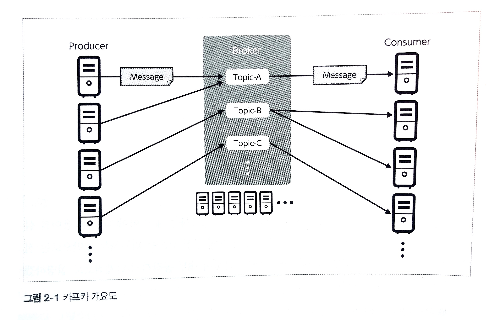  

* 브로커 - 데이터를 수신 전달하는 서비스
* 메시지 - 카프카에서 다루는 데이터의 최소 단위, 메시지는 key, value를 가지게 되며 메시지 전송 시 파티셔닝에 이용
* 프로듀서 - 데이터 생산자이며 브로커에 메시지를 보내는 애플리케이션
* 컨슈머 - 브로커에서 메시지를 취득하는 애플리케이션
* 토픽 - 메시지를 토픽별로 관리하는 스토리지로 브로커에 배치되어 관리된다. 프로듀서와 컨슈머는 특정 토픽을 지정해 메시지를 송수신하며 단일 카프카 클러스터에서 여러 종류의 메시지를 중계한다.

## 2.3 시스템 구성
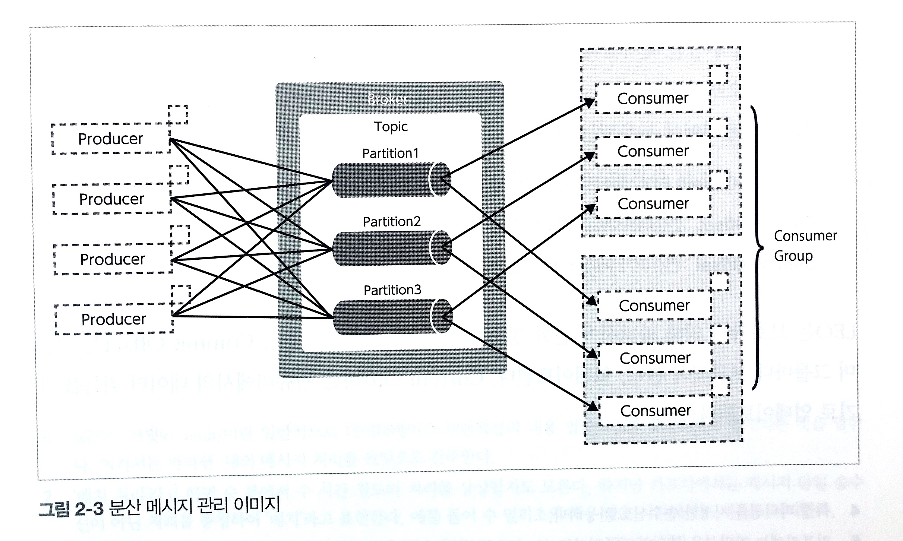  

### Broker / 브로커  
브로커는 하나의 서버(또는 인스턴스) 당 하나의 데몬 프로세스로 동작하여 **메시지 수신/전달 요청**을 받아들입니다.  
이것을 여러 대의 클러스터로 구성할 수 있으며 브로커를 추가함으로써 **수신/전달의 처리량 향상, 스케일 아웃이 가능**합니다.  
브로커에서 받은 데이터는 모두 디스크로 내보내기(영속화)가 이루어져 디스크의 총 용량에 따라 **장기간 데이터를 보존**할 수 있습니다.

### Product Api/ Consumer Api  
브로커에 데이터를 보내고 브로커에서 데이터를 받기 위한 라이브러리로 제공된다. 각각의 API는 자바로 제공된다.  

### Producer / 프로듀서  
각종 로그 전송 및 미들웨어와 연동 동작한다.  
프로듀서 기능을 내장하거나 서드 파티를 통해 제공하는 종류는 **Log4j**, Flume, Fluentd, Logstash 등이 있다.  

### Consumer / 컨슈머  
카프카 연계를 위한 컨슈머 기능을 가진 제품도 많이 존재한다. Spark, Logstash 등이 있다.  

### ZooKeeper / 주키퍼  
카프카에서 브로커의 분산 처리를 위한 관리 도구로 아파치 주키퍼가 필요하다. 주키퍼는 병렬 분산 처리용 OSS에 있어 설정 관리, 이름 관리, 동기화를 위한 잠금 관리를 하는 구조로 자주 사용된다.  
카프카에 있어선 분산 메시징의 메타 데이터를 관리하기 위한 요소로 기능한다.  

### Kafka Client / 카프카 클라이언트  
카프카 동작 및 운영에 필요한 조작을 실행하는 서버다. 메시지 송수신을 처리하지 않는다.  

### Kafka Cluster / 카프카 클러스터
여러 대의 브로커, 주키퍼 서버로 이뤄진 클러스터링 메시지 중계 기능과 메시지 송수신을 위한 그룹으로 구성된다. 브로커와 주키퍼를 묶어 카프카 클러스터라고 부른다.  

## 2.4 분산 메시징을 위한 구조
### Partition / 파티션  
토픽에 대한 대량의 메시지 입출력을 지원하기 위해, 브로커 상의 데이터를 읽고 쓰는 것은 파티션이라는 단위로 분할합니다.  
토픽을 구성하는 파티션은 브로커 클러스터 안에 분산 배치되며 프로듀서로부터 메시지 수신, 컨슈머에게 배달을 분산 실시함으로써 하나의 토픽에 대한 **대규모 데이터 수신과 전달을 지원**하게 됩니다.

**적정 파티션 수**  
구성 및 요구 사항에 따라 다르기 때문에 시스템을 설계할 때 고려  
메시지 처리 속도, 컨슈머 그룹 내 컨슈머 개수, 컨슈머내 스레드 수 등을 동시에 고려해야 함  
파티션 수는 증가할 수는 있지만 한 번 증가한 파티션 수는 다시 줄일 수 없음  

### Consumer Group / 컨슈머 그룹
단일 애플리케이션 안에서 여러 컨슈머가 단일 토픽 또는 여러 파티션에서 메시지를 취득하는 방법으로 컨슈머 그룹이라는 개념이 존재한다.  
카프카 클러스터 전체에서 글로벌 ID를 공유하고 여러 컨슈머는 자신이 소속한 컨슈머 그룹을 식별해 읽을 파티션을 분류하고 재시도를 제어한다.  

### Offset / 오프셋
각 파티션에서 수신한 메시지는 일련번호가 부여되어 파티션 단위로 메시지 위치를 나타내는 오프셋이라는 관리 정보를 이용해 컨슈머가 취득하는 메시지의 범위 및 재시도를 제어한다.  
제어에 사용되는 오프셋은 다음과 같다.  
* Log-End-Offset: 파티션 데이터의 끝을 나타낸다. - 브로커에 의해 업데이트
* Current Offset: 컨슈머가 어디까지 읽었는지 나타낸다. - 컨슈머 그룹마다 관리되어 업데이트
* Commit Offset: 컨슈머가 어디까지 커밋했는지를 나타낸다. - 컨슈머의 데이터 취득을 계기로 업데이트

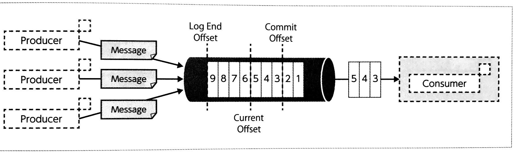

## 2.4.1 메시지 송수신
카프카에게 메시지 송수신은 반드시 하나의 메시지 단위로 송수신하진 않는다. 처리량을 높이기 위해 어느 정도 메시지를 축적해 배치 처리로 송수신하는 기능 또한 제공한다.  

### 프로듀서의 메시지 송신
프로듀서가 토픽의 파티션에 메시지를 송신할때 프로듀서의 메모리를 이용해 일정량을 축적 후 송신할 수 있다.  
데이터의 송신에 대해서는 지정한 크기까지 메시지가 축적되거나 지정한 대기 시간에 도달하는 것 중 하나를 트리거로 전송한다.  
기본 설정으로 하나의 메시지는 1회 송신되지만, 대량으로 브로커에 송신하는 상황에서 네트워크 지연이 처리량에 영향을 주는 경우도 있어   
메시지를 배치로 송신함으로써 처리량을 향상시킨다.
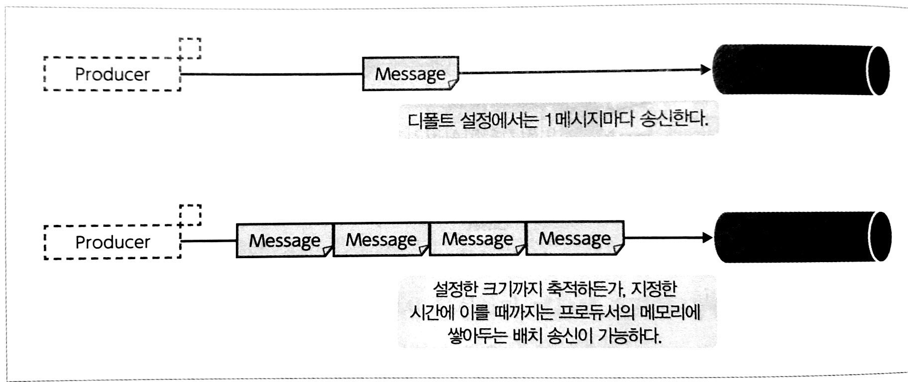

### 컨슈머의 메시지 취득
컨슈머는 취득 대상의 토픽과 파티션에 대해 Current Offset으로 나타나는 위치에 마지막으로 취득한 메시지로부터 
브로커에서 보관하는 최신 메시지까지 모아서 요청 및 취득을 실시하고, 그것을 반복함으로써 계속적인 메시지 취득을 진행한다.  

작은 범위로 요청을 하는 경우  
요청으로 하나의 메시지를 취득하는 경우 하나의 메세지 마다 Current Offset을 업데이트 한다.  

일정 간격을 두고 요청하는 경우  
프로듀서, 컨슈머에도 어느 정도 메시지를 모아 배치 처리함으로써 처리량을 향상시키는 효과는 기대할 수 있지만 
프로듀서 송신과 컨슈머 수신 처리 지연 시간은 증가한다.

### 컨슈머의 롤백
컨슈머는 위와 같이 지속적으로 메시지를 가져오지만, offset commit 구조를 통해 컨슈머 처리 실패, 고장 시 롤백 메시지 재취득을 실현한다.  

(1) Offset 2까지 취득해 Offset Commit이 끝난 단계에서 Offset 3, 4, 5의 메세지를 취득 한다
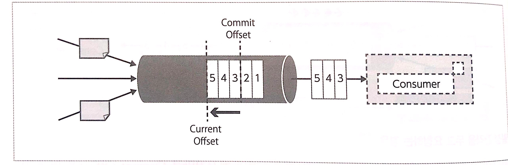
(2) 컨슈머 쪽 처리가 끝나 Offset Commit을 실행하고, Commit Offset을 5까지 진행한다.
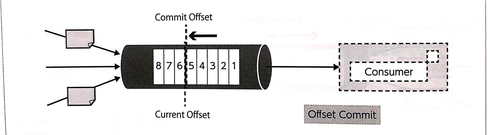
(3) 컨슈머 쪽에서 처리 중 Offset Commit을 실행하기 전에 컨슈머에서 장애가 발생한다.
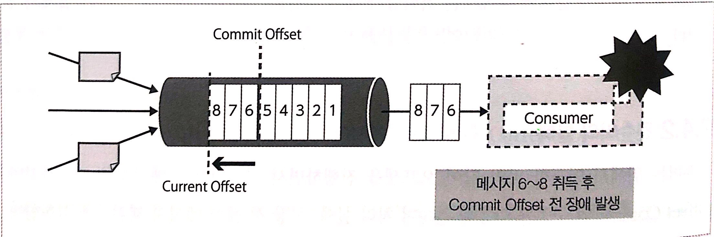
(4) 컨슈머가 장애에서 복구되면 Commit Offset 부터 재개 한다
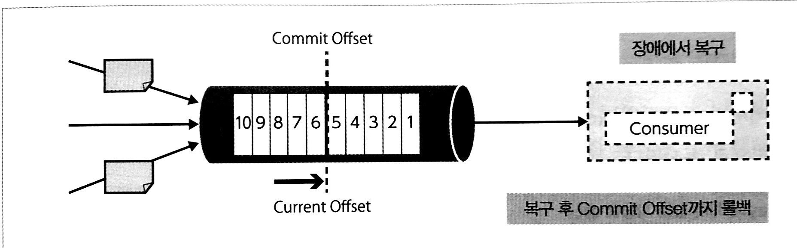
(5) 메시지를 재취득 한다.
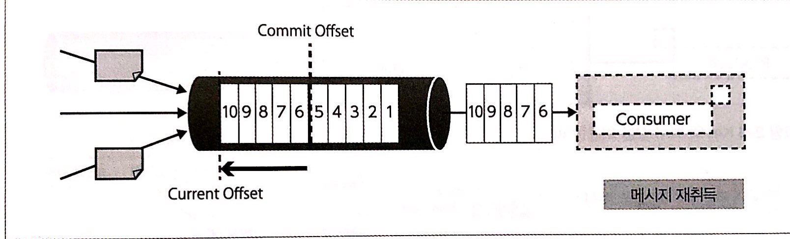

여기서 중요한 점은 다시 되돌아온 오프셋 간 메시지에 대한 대처를 애플리케이션에 맡긴다는 점이다.  
메시지 처리 완료 상태에서 Commit Offset 업데이트 직전 고장의 경우 동일한 메시지가 재전송되기에 중복 처리가 필요하다.  
이 재시도는 Exactly Once(빠짐없이 중복이 없는 송신)가 아니라 At Least Once(최소 1번)로 송신하는 구조다.  
고장 감지, 복구에 대해서도 카프카에서 제공되는 것은 아니기 때문에 Comsummer API를 이용한 애플리케이션 쪽에서 대처가 필요하다.  

다행히도 대부분의 분산 처리 프레임워크는 컨슈머의 고장 또는 장애를 감지해 재실행하는 매커니즘이 있기에 일반 사용자가 감지하는 경우는 드물다.

### 2.4.3 메시지 전송 시 파티셔닝
프로듀서에서 송신하는 메시지를 어떻게 파티션으로 보낼지 결정하는 파티셔닝(분할) 기능이 제공되고 있다. 
보내는 메시지에 포함된 Key, Value 중 Key가 명시적인 지정 여부에 따라 다음 두가지 패턴 로직으로 송신된다.  

#### Key의 해시 값을 사용한 송신
메시지의 Key를 명시적으로 지정함으로써 Key에 따라 송신처 파티션을 결정하는 로직이 된다. 동일한 Key를 가진 메시지는 동일한 ID를 가진 파티션에 송신된다.
동일한 키를 가진 메시지를 동일한 컨슈머에서 취득하여 처리하게 할 수 있다. 하지만 파티션 편향에 주의를 기울여야 한다.
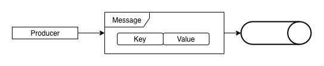

#### 라운드 로빈에 의한 송신
메시지 Key를 지정하지 않고 Null로 한 경우 여러 파티션으로 메시지 송신을 라운드 방식으로 실행한다.
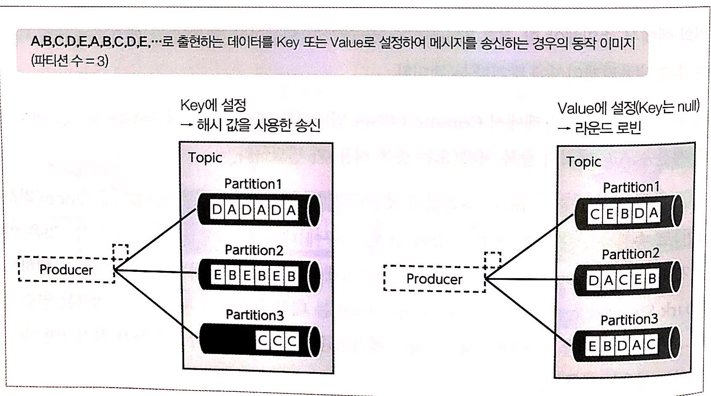

위의 로직은 DefaultPartitioner 이용해 구현한다. key, value 값에 따른 송신 로직을 커스텀으로 구현할 수 있다.

#### DefaultPartitioner 구현
DefaultPartitioner는 라운드 로빈 방식으로 구현되어 있다.
```java
public class DefaultPartitioner implements Partitioner {
    private final ConcurrentMap<String, AtomicInteger> topicCounterMap = new ConcurrentHashMap<>();
    public void configure(Map<String, ?> configs) {}
  
    public int partition(String topic, Object key, byte[] keyBytes, Object value, byte[] valueBytes, Cluster cluster) {
        List<PartitionInfo> partitions = cluster.partitionsForTopic(topic);
        int numPartitions = partitions.size();
        if (keyBytes == null) {
            int nextValue = nextValue(topic);
            List<PartitionInfo> availablePartitions = cluster.availablePartitionsForTopic(topic);
            if (availablePartitions.size() > 0) {
                int part = Utils.toPositive(nextValue) % availablePartitions.size();
                return availablePartitions.get(part).partition();
            } else {
                // no partitions are available, give a non-available partition
                return Utils.toPositive(nextValue) % numPartitions;
            }
        } else {
            // hash the keyBytes to choose a partition
            return Utils.toPositive(Utils.murmur2(keyBytes)) % numPartitions;
        }
    }
    
    private int nextValue(String topic) {
        AtomicInteger counter = topicCounterMap.get(topic);
        if (null == counter) {
            counter = new AtomicInteger(ThreadLocalRandom.current().nextInt());
            AtomicInteger currentCounter = topicCounterMap.putIfAbsent(topic, counter);
            if (currentCounter != null) {
                counter = currentCounter;
            }
        }
        return counter.getAndIncrement();
    }
    
    public void close() {}
}
```

### 2.5 데이터의 견고성을 높이는 복제 구조
카프카는 메시지를 중계함과 동시에 서버가 고장 났을 때에 수신한 메시지를 잃지 않기 위해 복제 구조를 갖추고 있다.  
아래 구조는 토픽 1개, 파티션 1개로 되어 있다.  
파티션은 단일 또는 여러 개의 레플리카로 구성되어 토픽 단위로 레플리카 수를 지정할 수 있다.  
Follower는 Leader로부터 메시지를 지속적으로 취득해 복제를 유지하도록 동작한다. 프로듀서와 컨슈머와의 데이터 송수신은 Leader가 맡는다.  

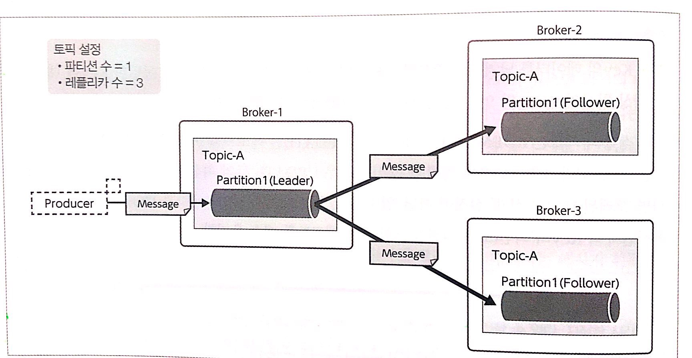

### 2.5.1 레플리카의 동기 상태
리더 레플리카의 복제 상태를 유지하는 레플리카는 In-Sync Replica로 분류된다. 콘솔에선 ISR로 분류된다. 최소 ISR 수(min.insync.replica) 설정이 가능하며,
고장으로 인한 일시적 동기 지연을 허용해 읽고 쓰기가 가능하다.

### 2.5.2 복제 완료 최신 오프셋
복제 사용시 오프셋 관리는 LEO 이외의 High Watermakr 라는 개념이 있다. High Watermakr는 복제가 완료된 오프셋이며, 
그 성질에 반드시 Log End Offset과 동일하거나 오래된 오프셋을 나타낸다.

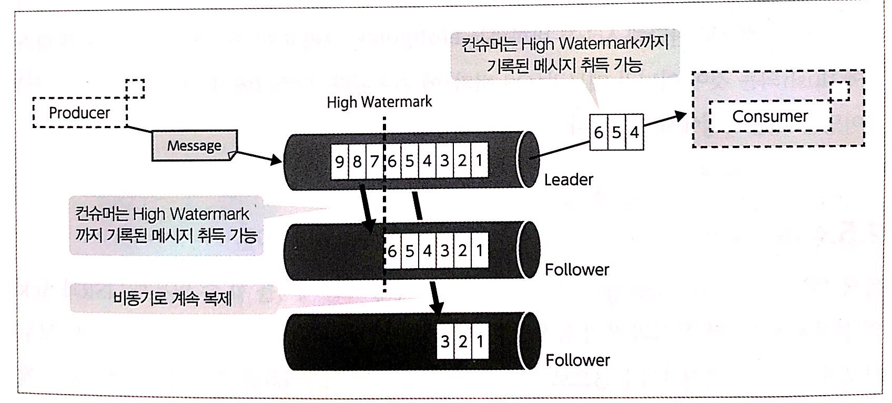

### 2.5.3 프로듀서의 메시지 도달 보증 수준
브로커에서 프로듀서로 메시지가 송신된 것을 나타내는 Ack를 어느 타이밍에 송신할 것인지를 제어하는 것은 
성능과 내장애성(브로커 서버 고장 시 데이터 분실 방지)에 큰 영향을 준다.  

| Ack 설정 | 설명 |
|---|---|
| 0  | 프로듀서는 메시지 송신 Ack를 기다리지 않고 다음 메시지를 송신한다.  |
| 1  | Leader Replica에 메세지가 전달되면 Ack를 반환한다.  |
| ALL  | 모든 ISR의 수만큼 복제되면 Ack를 반환한다.  |