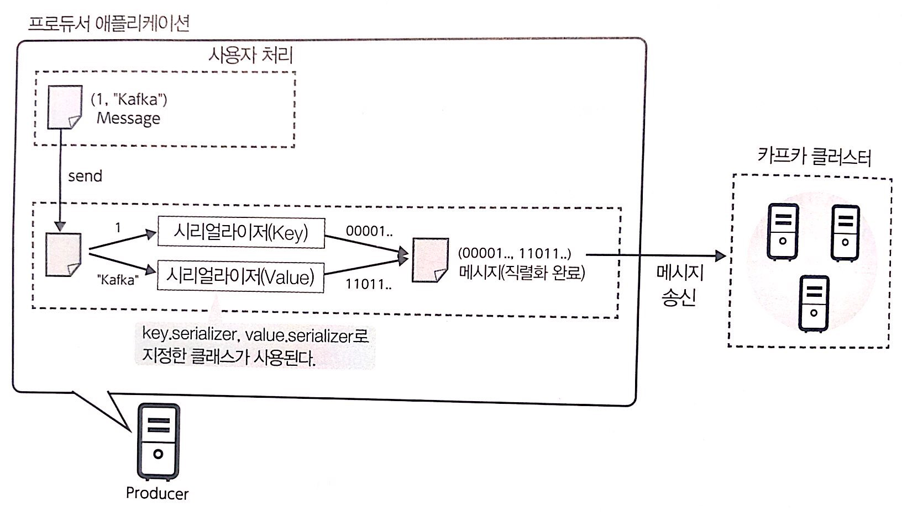
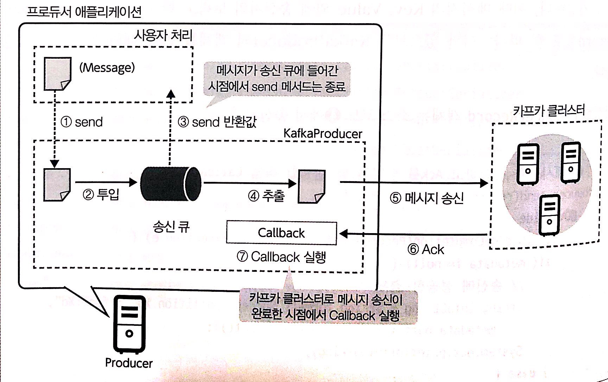
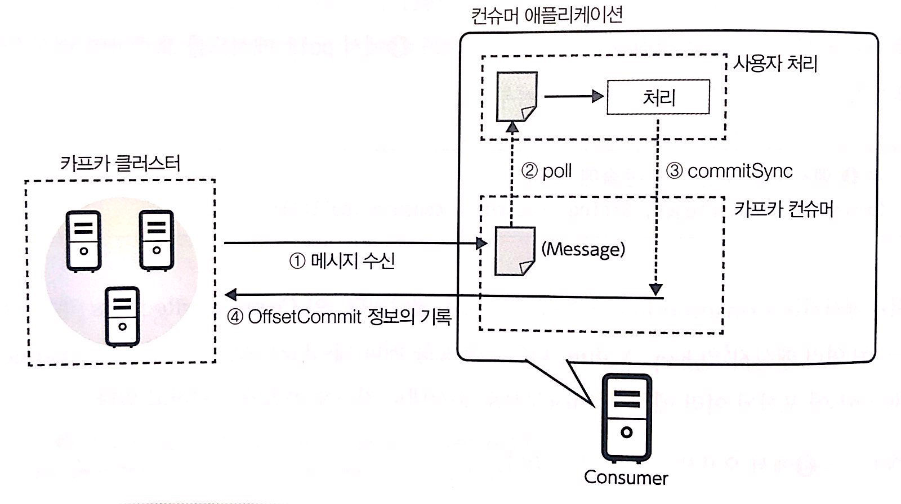

# 4장 자바 API를 사용하여 애플리케이션 만들기

## KafkaProducer 객체 작성
bootstrap.servers는 Producer가 접속하는 브로커의 호스트명과 포트 번호를 지정할 수 있다.
key.serializer, value.serializer는 카프카가 모든 메시지가 직렬화되어 전송되기에 serializer를 이용한다.
```java
// (1) KafkaProducer에 필요한 설정
final Properties conf = new Properties();

conf.setProperty("bootstrap.servers", "kafka-broker01:9092,kafka-broker02:9092,kafka-broker03:9092");
conf.setProperty("key.serializer", "org.apache.kafka.common.serialization.IntegerSerializer");
conf.setProperty("value.serializer", "org.apache.kafka.common.serialization.StringSerializer");

// (2) 카프카 클러스터에서 메시지를 송신(Produce) 하는 객체 생성
final Producer<Integer, String> producer = new KafkaProducer<>
```


KafkaProducer의 송신 처리는 비동기적으로 이루어지기 때문에 send 메서드를 호출했을 때 발생하지 않는다.
send 메서드의 처리는 KafkaProducer의 송신 큐에 메시지를 넣을 뿐이다.  
송신 큐에 넣은 메시지는 사용자의 애플리케이션과 다른 별도의 스레드에서 순차적으로 송신된다.  
메시지가 송신된 경우 클러스터에서 Ack이 반환된다. Callback 클래스의 메서드는 ack을 받았을때 처리된다.  



## KafkaConsumer 객체 생성

```java
// (1) KafkaConsumer에 필요한 설정
final Properties conf = new Properties();
conf.setProperty("bootstrap.servers", "kafka-broker01:9092,kafka-broker02:9092,kafka-broker03:9092");
conf.setProperty("group.id", "FirstAppConsumerGroup");
conf.setProperty("enable.auto.commit", "false");
conf.setProperty("key.deserializer", "org.apache.kafka.common.serialization.IntegerDeserializer");
conf.setProperty("value.deserializer", "org.apache.kafka.common.serialization.StringDeserializer");
```

1. group.id: 작성할 KafkaComsumer가 속한 Consumer Group을 지정한다. 
2. enable.auto.commit: 오프셋 커밋을 자동으로 실행할지 여부를 지정한다. 여기서는 커밋을 수동으로 하기 때문에 false 
3. key.deserializer, value.deserializer: 컨슈머의 사용자 처리에 전달되기 전에 실시되는 디시얼라이즈 처리에 이용되는 역질렬화 클래스를 지정한다.

