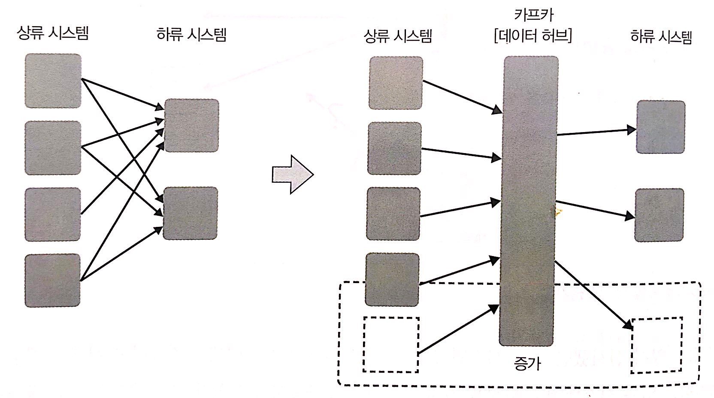
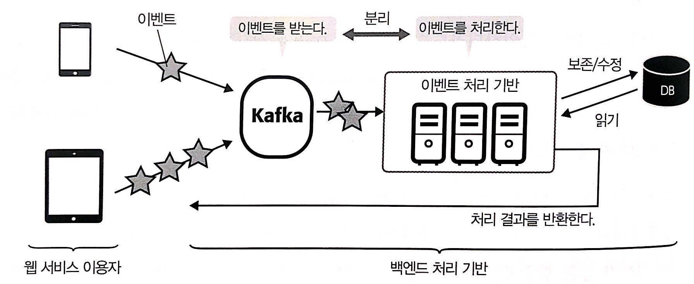

# 카프카 사례

## 카프카 대표적 기능
* **데이터 허브**: 여러 시스템 사이에서 데이터를 상호 교환한다. 
* **로그 수집**: BI 도구를 이용한 리포팅과 인공지능 분석을 위해 여러 서버에서 생성된 로그를 수집하고 축적할 곳에 연결 한다. 
* 웹로그 활동 분석: 실시간 대시보드와 이상/부정 검출 등 웹에서의 사용자 활동을 실시간으로 파악한다. 
* 사물 인터넷: 센서 등 다양한 디바이스에서 보낸 데이터를 수신해 처리한 후 디바이스에 송신한다. 
* **이벤트 소싱**: 데이터에 대한 이벤트를 순차적으로 기록하고 CQRS 방식으로 대량의 이벤트를 유연하게 처리한다.

## 카프카 특징 복습
카프카는 대량의 데이터를 높은 처리량으로 실시간 처리하기 위한 제품이다. 카프카의 아키텍처는 변한없이 데이터 상호 교환을 위한 기반으로 발전해왔다. 
현재는 카프카가 데이터를 전달하는 파이프라인 그 자체를 구성하기 위한 기반이라고 말할 정도다.

#### 카프카의 4가지 특정
1. 확장성: 여러 서버로 확장(스케일 아웃) 구성할 수 있기 때문에 데이터 양에 따라 시스템과 확장이 가능하다.
2. 영속성: 수신한 데이터를 디스크에 유지할 수 있기 때문에 언제라도 데이터를 읽을 수 있다.
3. 유연성: 연계할 수 있는 제품이 많기 때문에 제품이나 시스템을 연결하는 허브 역할을 한다.
4. 신뢰성: 메시지 전달 보증을 하므로 데이터 분식을 걱정하지 않아도 된다.

## 카프카 특징과 사례 대응
| 사례      | 실시간 | 동보 전송 | 영속성 | 다수의 제휴 제품 | 송수신 보증 | 순서 보증 |
| ------- | --- | ----- | --- | --------- | ------ | ----- |
| 데이터 허브  | X   | O     | O   | O         | O      | X     |
| 로그수집    | X   | X     | O   | O         | O      | X     |
| 웹 활동 분석 | O   | X     | X   | O         | O      | O     |
| 사물인터넷   | O   | X     | X   | O         | X      | X     |
| 이벤트 소싱  | O   | X     | O   | X         | O      | O     |

### 데이터 허브
데이터 허브란 여러 곳의 데이터소스가 되는 시스템에서 데이터를 수집하여 여러 시스템에 전잘하는 아키텍처를 의미한다.

**카프카로 데이터 허브 구현하기**  
사일로화를 해결하기 위한 개념의 하나로 데이터 허브 아키턱처가 있다. 데이터 허브 아키텍처란 **데이터 소스가 되는 시스템에서 데이터를 수집하여 해당 데이터를 여러 시스템에 전잘하는 아키텍처다.**

### 로그 수집
여러 로그의 결과를 모아 시각화싶은 경우가 있다. 그 때마다 서버에 들어가 확인하는 것은 귀찮은 일이다.  
로그 수집은 여러 데이터 소스와 연결되어야 한다. 또한 로그 전달 시 로그를 잃어서는 안된다.  
카프카는 다수의 연계 플랫폼이 있고 디스크에 영속화된다는 장점이 있어 나중에 다시 읽을 수 있다. 또한 At Least Once 수준의
송수신을 지원한다.

### 이벤트 소싱
#### 이벤트 소싱이란?
이벤트 소싱은 상태의 변화 하나하나를 이벤트로 취급하여 발생하는 이벤트를 순서대로 기록해두는 것이다.  
사용자는 기록된 이벤트에서 도메인 객체를 구체화할 수 있으며 경위도 확인할 수있다.  
알기 쉽게 설명하면 DBMS의 트랜잭션 로그의 레코드 쓰기를 상상하면 좋을것이다.  
카프카는 데이터를 모두 추상적인 로그로 취급하고 받은 메시지는 로그에 순차적으로 기록되기 때문에
카프카가 이벤트 소싱에 적합하다는 것을 알 수 있다. 또한 이벤트 소싱과 더블어 이해해야 하는 것이 CQRS다.

#### CQRS이란?
CQRS (Command Query Responsibility Segregation, 커멘드 쿼리 책임 분리)란 데이터의 생신과 문의 처리를 분리하는 아키텍트다.  
Command란 데이터의 Create/Update/Delete 등 데이터 갱신 처리에 해당한다. 쿼리란 데이터의 문의, 즉 참조 처리에 해야한다.  
CQRS는 Command(갱신), Query(참조)의 책임을 분리 한다는 의미다. 커멘드 쪽인 갱신 처리는 데이터가 갱신되는 것에만 책임지고 처리한다.  
갱신 처리 시 참조 결과에 대해서는 반환하지 않으며 그 데이터가 어떻게 참조 되는지에 대해서도 관여하지 않는다. 
쿼리 쪽은 참조 처리는 적절한 결과를 반환하는 책임만 있다.

#### 이벤트 소싱 + CQRS에서 카프카 사용하기
CQRS 개념인 갱신 처리와 참조 처리의 분리를 위해 카프카를 아키텍트로 사용한다. 
카프카는 이벤트를 지정하는 저장소이며, 이벤트를 전잘하는 허브로 간주할 수 있다.  
CQRS는 다음과 같은 형태로 구현한다.
* 카프카가 데이터 소스에서 시계열 데이터를 받아 기록한다. 이것은 명령 쪽 역할을 한다. 
* 카프카가 데이터 싱크에 데이터를 전달한다. 받은 쪽은 자신의 쿼리에 있어 참조 효율이 좋은 형식으로 데이터를 변환하여 사용한다. 
* 이렇게 해서 커멘드와 쿼리의 분리가 가능 해진다.

카프카는 갱신 처리로 이벤트를 받는 역할을 한다. 쿼리에 해당하는 참조를 처리하기 위한 형식 변환은 카프카와 분리된 별도 기반에서 담당한다.  
카프카는 커맨드의 순차 기록과 데이터 허브로서 데이터를 전달하는 두 가지 역할을 담당한다.  

이렇게 이벤트 소싱과 CQRS 패턴을 조합함으로써 애플리케이션에서 쓰기와 읽기 패턴이 다르더라도 유연하게 대응할 수 있다.