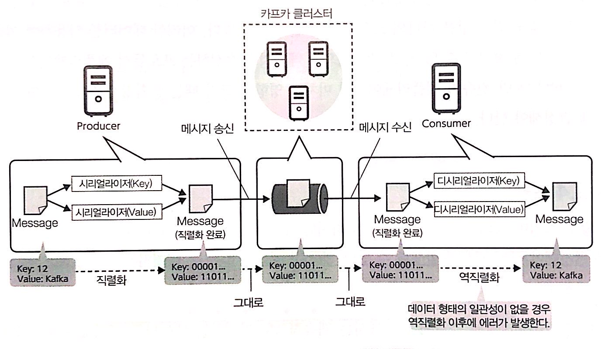
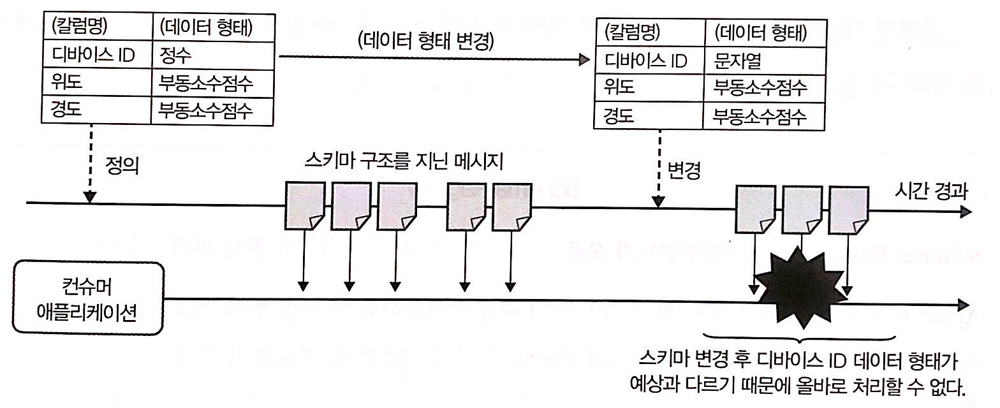

# 6장 카프카를 이용한 데이터 파이프라인 구축에 필요한 사전지식

## 카프카를 이용한 데이터 파이프라인의 구성 요소
### 데이터 파이프라인이란 ?
카프카는 분산 메시징 시스템으로 다른 시스템이나 도구에서 보낸 메시지를 받아 다른 시스템이나 
도구의 요청에 근거해 메시지를 전달하는 기능을 제공하고 있다.  
카프카는 데이터의 발생, 수집, 가공, 저장 출력에 이르는 일련의 과정에서 도구와 
시스템을 연결하는 역할을 한다. 이 데이터가 전달되는 경로나 처리를 위한 기반 전체를 데이터 파이프 라인이라고 한다.

카프카가 하나 이상의 브로커로 된 카프카 클러스터, 프로듀서, 컨슈머, 카프카 클라이언트로 구성되어 있다고 소개했다.  
이 중에 데이터 파이프라인의 일부가 되는 것은 카프카 클러스터, 프로듀서, 컨슈머다.

### 데이터 파이프라인의 프로듀서 구성 요소
카프카를 이용한 데이터 파이프라인의 프로듀서 쪽은 데이터를 생성하고 송신하는 미들웨어가 카프카에 대응하고 있는지에 따라 
다음의 두 가지 패턴을 뷴류할 수 있다.

1. 미들웨어가 직접 카프카에 메시지를 송신하는 패턴 
2. 미들웨어가 직접 카프카에 데이터를 송신하지 않고 다른 도구로 메시지를 송신하는 패턴  

#### 직접 카프카에 메시지를 송신하는 패턴
말 그대로 사용하는 미들웨어가 카프카에 메시지를 송신하는 패턴이다. 
이 경우 미들웨어 기능을 이용하여 카프카에 필요한 메시지를 송신할 수 있으므로 비교적 쉽게 카프카로 데이터 파이프라인을 구출할 수 있다.  
최근 카프카로 메시지 송신을 지원하는 미들웨어도 늘고 있다. 카프카는 Kafka Streams라는 스트림 처리를 구현하기 위한 라이브러리가 포함되어 있다.  

#### 다른 도구로 메시지를 송신하는 패턴
일반적인 HTTP 서버는 액세스 로그를 카프카에 직접 송신하는 기능을 갖고 있지 않다. 
로컬의 로그 파일에 출력한 뒤 별도의 메시지 송신 도구를 사용해 카프카에 메시지로 송신하는 방식이 일반적이다

### 데이터 파이프라인의 컨슈머 구성 요소
1. 직접 카프카에서 메시지를 취득해 처리하는 패턴 
2. 다른 도구를 통해 카프카에서 메시지를 취득해 처리하는 패턴

#### 미들웨어가 직접 카프카에서 메시지를 취득해 처리하는 패턴
데이터를 처리하거나 기록하는 미들웨어가 카프카에서 메시지를 수신하는 패턴이다. 이 패턴은 배치 처리와 스트림 처리를 모두 대응할 수 있지만 
카프카 스트림 데이터를 취급하는 기반이기 때문에 특히 스트림 처리에서 많이 볼 수 있다.

#### 미들웨어가 다른 도구를 통해 카프카에서 메시지를 취득해 처리하는 패턴
이 패턴은 데이터를 처리하고 기록하는 시스템 또는 미들웨어가 카프카에서 메시지 수신을 지원하지 않아 
다른 도구로 카프카에서 메시지를 수신한 후 원하는 시스템에 데이터를 전잘하는 방식이다.

Kafka Connect와 Kafka Streams에 의한 데이터 파이프라인
카프카와 연계하여 사용할 수 있는 도구와 미들웨어가 늘어 다양한 형태의 데이터 파이프라인 디자인 패턴이 제한되고 있다.   
그리고 이러한 디자인 패턴의 하나로 컨플루언트는 Kafka Connect와 Kafka Streams를 이용한 데이터 파이프라인을 제시하고 있다.  
1. Kafka Connect를 이용하여 외부에서 카프카로 데이터를 송신한다.
2. Kafka Streams를 이용하여 필요한 데이터를 처리하고 처리 결과를 카프카에게 전송한다. 
3. Kafka Streams를 이용하여 연계 시스템에 데이터를 출력한다.

### 데이터 파이프라인에서 취급하는 데이터의 특성
1. 여러 미들웨어나 애플리케이션에서 데이터를 읽고 쓴다.
2. 애플리케이션은 항상 실행 상태로 데이터를 처리한다.

이러한 데이터 파이프라인에서의 처리 방법은 파이프라인을 구성하는 기반이나 애플리케이션, 취급하는 데이터를 설계할 때 고려해야 한다. 
그 중에서도 많은 구성 요소에 영향을 미치는 3가지 요소를 소개한다.
* 메시지 데이터 형태 
* 스키마 구조를 갖는 데이터 형태 및 스키마 에볼루션 
* 데이터 표현 방법

#### 메시지 데이터 형태
카프카를 이용한 데이터 파이프라인에서는 카프카를 경우하여 메시지를 송수신하는데, 
**이 메시지의 데이터 형태는 프로듀서와 컨슈머에서 불일치하지 않도록 해야한다.**
메시지는 프로듀서에서 처리되고 데이터 파이프라인 안의 카프카 클러스터로 송신된다.  
이 때 프로듀서에서 송신되는 메시지의 Key, Value 데이터 형태가 각각 프로듀서 애플리케이션에서 지정되고 데이터를 직렬화해서 송신한다.  
그리고 컨슈머는 미리 프로듀서에서 보낸 메시지의 Key, Value 데이터 형태와 포함된 데이터를 감안하여 설계하고 구현해야 한다.

컨슈머뿐만 아니라 송신하는 프로듀서에서도 매시지 데이터 형태에 주의가 필요하다. 따라서 컨슈머에서 보낸 메시지의 데이터 형태를 변경하려면 그에 해당하는 컨슈머도 변경해야 한다. 
그러나 애플리케이션은 항상 데이터를 처리하고 있어 쉽게 중단시킬 수 없는 경우가 있다.  
이러한 데이터의 불일치를 방지하기 위해 데이터 형태나 관리나 향후 확장을 위한 변경 방법에 대해서는 스키마 
구조를 갖는 데이터 형태를 이용하는 것도 좋은 대책 중 하나다.

#### 스키마 구조를 갖는 데이터 형태 & 스키마 에볼류션
데이터 스트림과 스트림 처리에서는 JSON이나 Apache Avro와 같은 구조화된 데이터가 자주 사용된다. 
여러 칼럼을 가진 스키마를 정의하여 하나의 메시지 안에 여러 값을 포함할 수 있게 된다.

애플리케이션 수정이나 기능 추가에 따라 정의를 변경해야 하는 경우가 많다. 스키마 정의를 운용 중 변경하는 것은 스키마 에볼루션 또는 스키마 진화라고 한다.  
스키마 에볼루션에 동반하여 정지할 애플리케이션의 수나 정지 시간을 최소화해야 하는 경우가 많다 다음은 스키마 호환성을 고려한 스키마 애볼루션의 예를 보여준다.

기존 칼럼을 변경하지 않고 새로운 칼럼을 추가하고 있다. 이 경우 스키마 정의를 변경한 후에도 기존 컨슈머 애플리케이션은 원하는 컬럼에서 
원하는 데이터를 얻을 수 있다. 한편 기존 칼람을 제거하거나, 데이터 형태가 변경될 경우 원래의 데이터 처리는 계속될수 없다.
