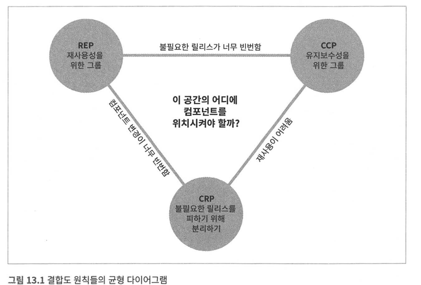

# 컴포넌트 응집도
이 장에서는 컴포넌트 응집도와 관련된 세 가지 원칙을 논의한다.

* REP: 재사용/릴리스 등가 원칙
* CCP: 공통 폐쇄 원칙
* CRP: 공통 재사용 원칙

### REP 재사용/릴리스 등가 원칙
재사용 단위는 릴리스 단위와 같다.!!  

컴포넌트가 릴리스 절차를 통해 추적 관리되지 않거나 번호가 부여되지 않는다면 해당 컴포넌트를 재사용하고 싶어도
할 수 없다.  
릴리스 절차에는 언제 출시되고 어떤 것이 변하는지 알아야 한다. 해당 사항을 알아야 새 릴리스를 통합할지, 언제 할지
결정할 수 있다.  
단일 컴포넌트는 응집성 높은 클래스와 모듈들로 구성되어야 한다.    

하나의 컴포넌트로 묶인 클래스와 모듈은 함께 릴리스할 수 있어야 한다.  

### CCP: 공통 폐쇄 원칙
동일한 이유로 동일 시점에 변경되는 클래스를 같은 컴포넌트로 묶어라.!!

이 원칙은 SRP를 컴포넌트 관점에서 다시 쓴 것이다. 대다수의 앱은 유지보수성이 재사용성보다 훨씬 중요하다.  

### CRP: 공통 재사용 원칙
컴포넌트 사용자들을 필요하지 않는 것에 의존하게 강요하지 마라.!!  

개별 클래스가 단독으로 재사용되는 경우는 거의 없다. 
의존성의 있는 컴포넌트가 있다면 사용하는 컴포넌트도 함께 변경해야 할 가능성이 높다.
따라서 의존하는 컴포넌트가 있다면 해당 컴포넌트의 모든 클래스에 의존함을 인지해야 한다.  
CRP는 ISP의 포괄적인 원칙이다. ISP는 사용하지 않는 메서드가 있는 클래스에 의존하지 말라고 조언한다.  

## 컴포넌트 응집도에 대한 균형 다이어그램
응집ㄷ에는 세 원칙이 서로 상충된다.  
REP, CCP는 포함 원칙으로 점차 컴포넌트를 크게 만드나, CRP는 컴포넌트를 더 작게 만든다.  

```java
REP,CRP 중점: 컴포넌트 변경이 빈번함.  
REP,CCP 중점: 불필요한 릴리스가 너무 빈번함.  
CCP,CRP 중점: 재사용이 어려움.
```
  

프로젝트 초기: CCP, CRP -> CCP가 중요하다. 초기는 개발 가능성이 더 중요하다.  
프로젝트 성숙, REP, CRP -> 파생된 프로젝트 발생 시: 삼각형에서 왼쪽으로 치우친다.